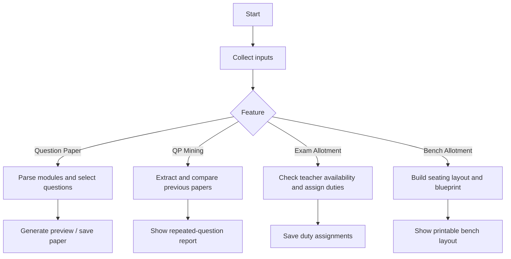
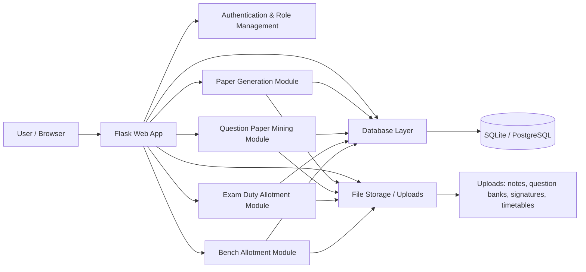

# Workflow and Algorithm Summary

This document describes the main workflows used in this project in a simple step-by-step form.

## 1) Automatic Question Paper Generator

### Goal
Generate a balanced question paper from uploaded question-bank modules.

### Flow
1. Teacher selects a subject and semester.
2. Teacher chooses one or more question-bank modules (PDFs).
3. The system reads each PDF and extracts questions.
4. Each extracted question is tagged with:
   - marks
   - CO (course outcome)
   - RBT level
   - module name
5. The system builds a pool of all questions.
6. It calculates the target paper structure based on:
   - total marks
   - number of COs
   - module balance
7. It selects questions one by one using a cost function that tries to:
   - balance CO coverage
   - balance module coverage
   - avoid duplicate questions
8. The generated paper is shown as a preview.
9. The paper is saved as a draft in the database.

### Core Algorithm
- Parse question-bank PDFs
- Group questions by marks
- For each required slot, choose the best question using a scoring/cost formula
- Keep the paper balanced across COs, modules, and marks

---

## 2) 10-Year Question Paper Mining

### Goal
Find repeated questions across previous year question papers.

### Flow
1. HOD uploads multiple previous-year question-paper PDFs.
2. The system extracts question blocks from each PDF.
3. Each question is normalized to remove formatting noise.
4. The system compares questions across files.
5. Repeated questions are counted.
6. The output shows:
   - repeated question text
   - number of occurrences
   - source papers and years
   - coverage percentage

### Core Algorithm
- Extract questions from each PDF
- Normalize text for comparison
- Use a frequency counter to find repeated items
- Rank the repeats by count and source spread

---

## 3) Teacher Exam Allotment

### Goal
Assign teachers to exam duty slots fairly and without conflict.

### Flow
1. HOD enters exam slots such as date, day, slot, subject, room, and semester.
2. HOD also configures teacher settings such as:
   - max duties
   - active/inactive status
3. For each exam slot, the system checks teachers who are available.
4. A teacher is skipped if:
   - the teacher is inactive
   - the teacher has already reached the duty limit
   - the teacher is busy for the same slot
   - the teacher does not have leisure time in the required timetable slots
5. Among the remaining teachers, the system chooses the teacher with the lowest current duty count.
6. The assignment is saved in the database.

### Core Algorithm
- Sort exams in order
- For each exam, find eligible teachers
- Filter by constraints
- Choose the least-loaded eligible teacher
- Save the mapping

---

## 4) Bench Allotment

### Goal
Arrange students in benches/rooms in a printable seating blueprint.

### Flow
1. HOD enters room details: room name, rows, and columns.
2. HOD enters student groups with:
   - branch
   - semester
   - section
   - subject
   - USN range
3. The system converts USN ranges into a full roll list.
4. It fills the bench layout seat by seat.
5. It avoids putting students from the same semester/branch in adjacent seats where possible.
6. It produces a visual blueprint and CSV export.

### Core Algorithm
- Build roll-number queues for each group
- Fill benches column-wise
- For each seat, look at the seat above and to the left
- Prevent adjacent same-semester or same-branch conflicts
- If needed, relax the restriction and continue
- Save the generated layout for printing

---

## Simple End-to-End Summary

## Overall Project Architecture

The application is built as a Flask-based academic workflow system with role-based access for HOD, teachers, and students.

### Main Components
- Frontend: HTML templates, CSS, and JavaScript
- Backend: Flask routes and business logic in app.py
- Database: user data, papers, question banks, timetables, exam duty records
- Storage: uploaded PDFs, images, signatures, notes, and timetables
- Modules:
  - paper generation
  - question-paper analysis
  - teacher exam duty allocation
  - bench seating blueprint generation

### End-to-End Flow
1. User logs in through the web interface.
2. Role-based pages are shown based on teacher, HOD, or student access.
3. Teachers upload resources and generate papers.
4. HOD manages approvals, analysis, duty allotment, and bench planning.
5. All outputs are stored in the database and upload storage.
